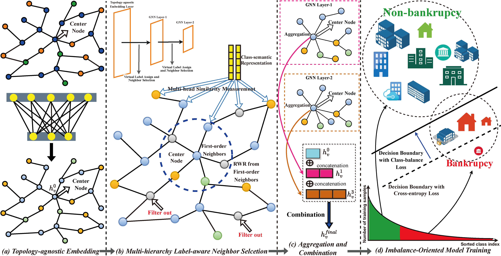

# QTIAH-GNN



Pytorch implementation of paper 'QTIAH-GNN: Quantity and Topology Imbalance-aware Heterogeneous Graph Neural Network for Bankruptcy Prediction'

## Dependencies
GPU
- Python 3.9.12
- Pytorch 1.12.0
- Deep Graph Library 0.9.0 
- NetworkX
- Scikit-Learn
- Numpy

## Dataset
The data set used in this project will be announced after the article is published with the permission of the data owner.

Kindly note that "group" in the paper is equivalent to "organize" in the code.

## Running

```
python main.py
```


## Contact

If any problems occurs via running this code, please contact us at liuzy.yucheng@foxmail.com.